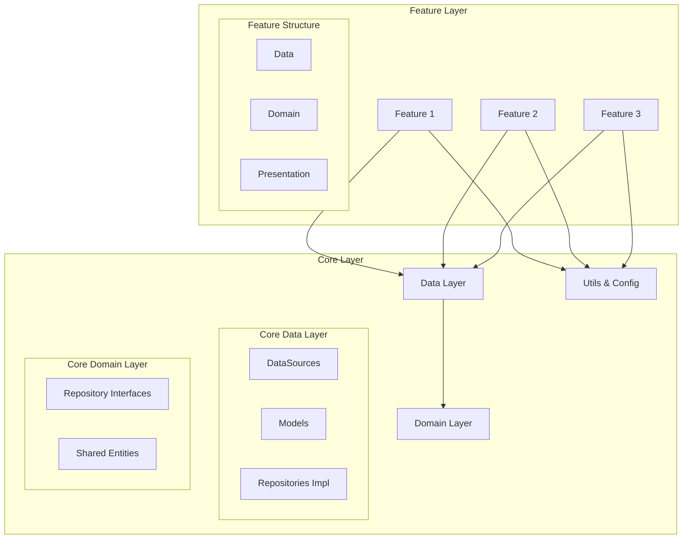
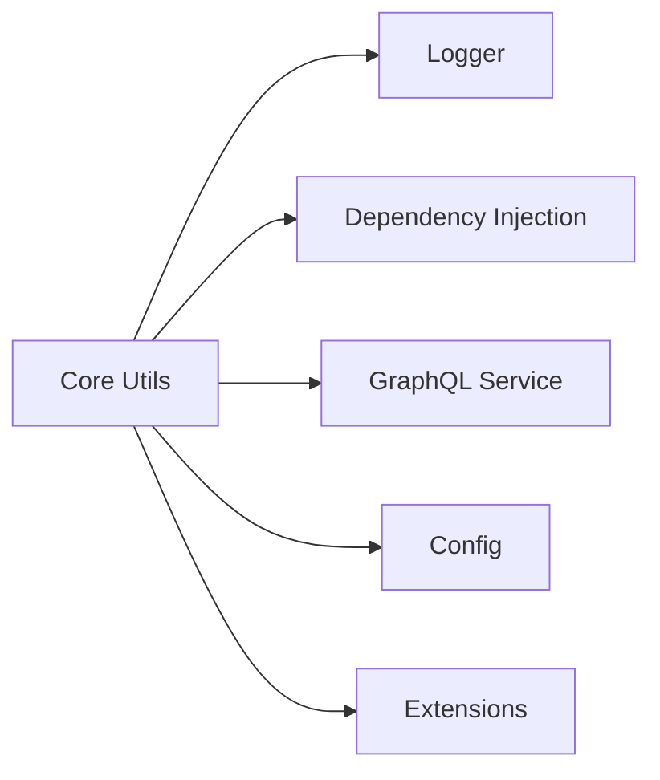
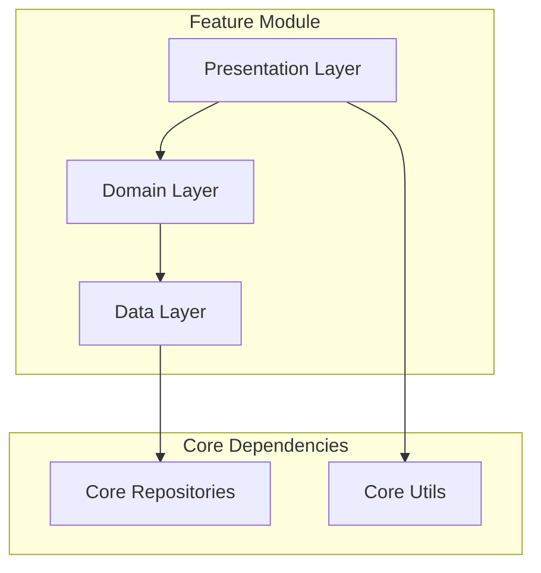
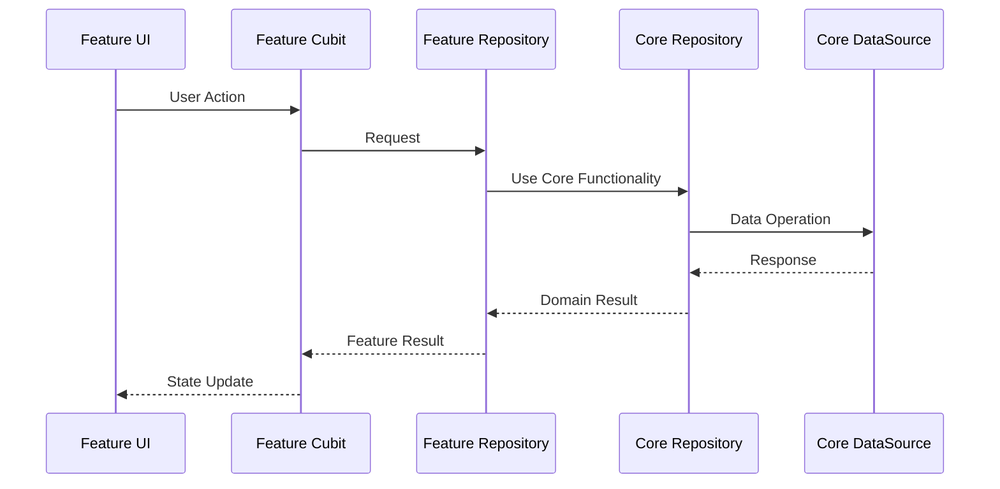
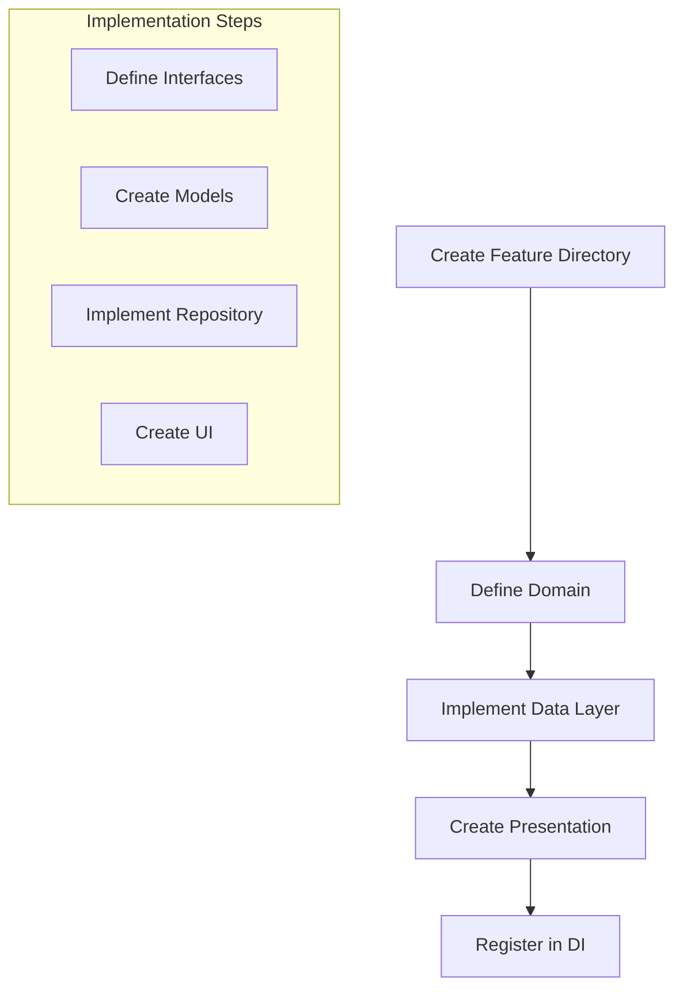
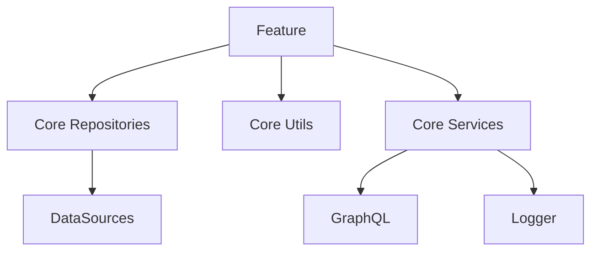
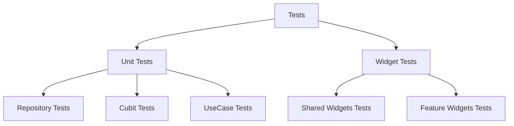

# Lieferking App - Technical Documentation

## 1. Architecture Overview



### Project Structure

```dart
lib/
├── core/                    # Shared Functionality
│   ├── data/
│   │   ├── datasources/    # Shared DataSources
│   │   ├── models/        # Shared Models
│   │   └── repositories/  # Shared Repository Implementations
│   ├── domain/
│   │   └── repositories/  # Shared Repository Interfaces
│   ├── config/           # App Configuration
│   ├── di/              # Dependency Injection
│   ├── extensions/      # Extensions
│   ├── graphql/        # GraphQL Setup
│   ├── mixins/         # Shared Mixins
│   └── shared_widgets/ # Common Widgets
│
└── features/            # Feature Modules
    └── feature_name/
        ├── data/
        │   ├── datasources/
        │   ├── models/
        │   └── repositories/
        ├── domain/
        │   └── repositories/
        └── presentation/
            ├── cubits/
            └── widgets/

```

## 2. Core Layer

### 2.1 Core Data Layer Implementation

```dart
// Core DataSource Example (core/data/datasources/user_datasource.dart)
abstract class UserDatasource {
  Future<CustomerResponse> getUser();
}

class UserDatasourceImpl implements UserDatasource {
  final GraphQLService _graphQLService;
  final LoggerUtils _logger;

  @override
  Future<CustomerResponse> getUser() async {
    try {
      final query = CustomerOperations.getActiveCustomer();
      final result = await _graphQLService.query(query);
      return CustomerResponse.fromActiveCustomerData(result.data);
    } catch (e) {
      _logger.logError('UserDatasourceImpl', 'Failed to get user: $e');
      rethrow;
    }
  }
}

// Core Repository Implementation (core/data/repositories/user_repository_impl.dart)
class UserRepoImpl implements UserRepository {
  final UserDatasource _userDatasource;

  @override
  Future<Either<CustomException, CustomerResponse>> getUser() async {
    return handleFuture(() async {
      final user = await _userDatasource.getUser();
      return user;
    });
  }
}

```

### 2.2 Core Domain Layer

```dart
// Core Repository Interface (core/domain/repositories/user_repository.dart)
abstract class UserRepository {
  Future<Either<CustomException, CustomerResponse>> getUser();
}
```

### 2.3 Core Utilities



```dart
// Dependency Injection (core/di/injection.dart)
class Injection {
  static final sl = GetIt.instance;

  static Future<void> init() async {
    // Core Services
    sl.registerSingleton<LoggerUtils>(LoggerUtils());
    sl.registerSingleton<GraphQLService>(GraphQLService());

    // Core Repositories
    sl.registerLazySingleton<UserRepository>(
      () => UserRepoImpl(sl<UserDatasource>())
    );
  }
}

```

## 3. Feature Layer

### 3.1 Feature Architecture



### 3.2 Feature Implementation Example (Address Entry)

```dart
features/
└── address_entry/
    ├── data/
    │   ├── datasources/
    │   │   └── address_entry_datasource.dart
    │   ├── models/
    │   │   └── address_model.dart
    │   └── repositories/
    │       └── address_repository_impl.dart
    ├── domain/
    │   └── repositories/
    │       └── address_repository.dart
    └── presentation/
        ├── cubits/
        │   ├── address_entry_cubit.dart
        │   └── address_entry_state.dart
        └── widgets/
            └── address_entry_view.dart

```

### Data Layer

```dart
// Feature-specific Model
class AddressModelForLocation extends Equatable {
  final String id;
  final String fullAddress;
  final String? streetAddress;
  final String? city;

  AddressModelForLocation({
    String? id,
    required this.fullAddress,
    this.streetAddress,
    this.city,
  });

  Map<String, dynamic> toJson() => {
    'id': id,
    'fullAddress': fullAddress,
    'streetAddress': streetAddress,
    'city': city,
  };
}

// Feature Repository Implementation using Core Repository
class AddressEntryRepositoryImpl implements AddressEntryRepository {
  final LocationRepository _locationRepository; // Core repository

  @override
  Future<void> saveAddress(AddressModelForLocation address) async {
    try {
      // Using core repository functionality
      await _locationRepository.saveCurrentAddress(address);
    } catch (e) {
      throw AddressException('Failed to save address');
    }
  }
}

```

### Domain Layer

```dart
// Feature-specific Repository Interface
abstract class AddressEntryRepository {
  Future<void> saveAddress(AddressModelForLocation address);
  Future<List<AddressModelForLocation>> getRecentAddresses();
}

```

### Presentation Layer

```dart
// Feature State
abstract class AddressEntryState extends Equatable {
  @override
  List<Object?> get props => [];
}

class AddressEntryInitial extends AddressEntryState {}
class AddressEntryLoading extends AddressEntryState {}
class AddressEntrySuccess extends AddressEntryState {
  final AddressModelForLocation address;
  AddressEntrySuccess(this.address);

  @override
  List<Object?> get props => [address];
}

// Feature Cubit
class AddressEntryCubit extends Cubit<AddressEntryState> {
  final LocationRepository _locationRepository; // Core repository
  final LoggerUtils _logger; // Core utility

  AddressEntryCubit({
    required LocationRepository locationRepository,
    required LoggerUtils logger,
  }) : _locationRepository = locationRepository,
       _logger = logger,
       super(AddressEntryInitial());

  Future<void> saveAddress(AddressModelForLocation address) async {
    emit(AddressEntryLoading());
    try {
      await _locationRepository.saveAddress(address);
      emit(AddressEntrySuccess(address));
    } catch (e) {
      _logger.logError('AddressEntryCubit', e.toString());
      emit(AddressEntryError(message: e.toString()));
    }
  }
}

```

### 3.3 Core-Feature Interaction



## 4. Implementation Guidelines

### 4.1 Adding New Features



### Step-by-Step Guide:

1. **Create Feature Structure**

```dart
feature_name/
├── data/
│   ├── datasources/
│   ├── models/
│   └── repositories/
├── domain/
│   └── repositories/
└── presentation/
    ├── cubits/
    └── widgets/

```

1. **Identify Core Dependencies**

```dart
// Determine which core repositories you need
final LocationRepository locationRepository;
final UserRepository userRepository;

// Identify required core utilities
final LoggerUtils logger;
final GraphQLService graphQLService;

```

1. **Implement Feature Layers**

```dart
// 1. Domain Layer - Define interfaces
abstract class FeatureRepository {
  Future<Result> performAction();
}

// 2. Data Layer - Implement with core dependencies
class FeatureRepositoryImpl implements FeatureRepository {
  final CoreRepository _coreRepository;

  @override
  Future<Result> performAction() {
    return _coreRepository.performCoreAction();
  }
}

// 3. Presentation Layer - Use both feature and core
class FeatureCubit extends Cubit<FeatureState> {
  final FeatureRepository _featureRepository;
  final CoreRepository _coreRepository;
}

```

### 4.2 Core Module Usage

### When to Use Core Layer

✅ **Use Core When**:

- Functionality is shared across features
- Base infrastructure is needed
- Common utilities are required

❌ **Don't Use Core When**:

- Feature-specific logic
- One-time use components
- UI-specific implementations

### Example of Core Usage

```dart
// Good - Shared Repository in Core
abstract class UserRepository {
  Future<User> getUser();
  Future<void> updateUser(User user);
}
```

### 4.3 Dependency Management



### Dependency Registration

```dart
// In core/di/injection.dart
class Injection {
  static Future<void> init() async {
    // Core Services
    sl.registerSingleton<LoggerUtils>(LoggerUtils());
    sl.registerSingleton<GraphQLService>(GraphQLService());

    // Core Repositories
    sl.registerLazySingleton<UserRepository>(
      () => UserRepoImpl(sl())
    );

    // Feature Dependencies
    sl.registerFactory(() => AddressEntryCubit(
      locationRepository: sl(),
      logger: sl(),
    ));
  }
}

```

## 5. Testing Strategy

### 5.1 Testing Architecture



### 5.2 Testing Best Practices

1. **Core Layer Testing**
- Test all repository implementations
- Mock external dependencies
- Test error handling
- Verify data transformations
1. **Feature Layer Testing**
- Test feature-specific logic
- Test integration with core
- Verify state management
- Test UI behavior
1. **Test Organization**

```dart
test/
├── core/
│   ├── data/
│   │   └── repositories/
│   └── domain/
└── features/
    └── feature_name/
        ├── data/
        ├── domain/
        └── presentation/

```